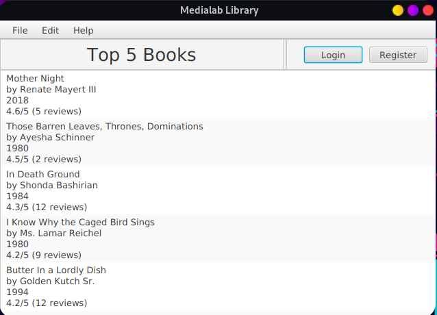
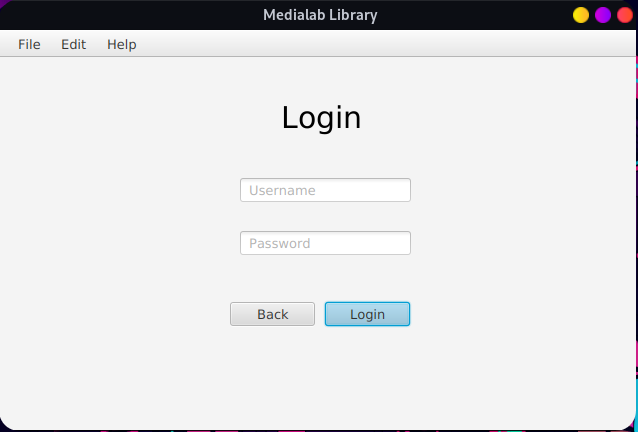
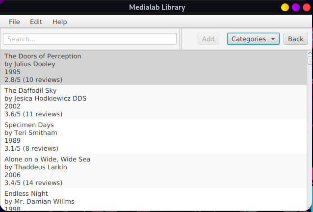

# MediaLib

## About
MediaLib is a multimedia course project developed by students of the [National Technical University of Athens](https://www.ntua.gr). It is an electronic library system that allows administrators to manage and monitor library material, while users can search for books, apply for their loan, and add comments and ratings.

## Screenshots
<p align='center'>
  
  
  
</p>

## Members
- [Altan Avtzi](https://github.com/avtzis) - el19241

## Goal and Requirements
The primary goal of this project is to introduce students to Java programming and get them familiar with its applications in developing real-world software. It focuses on designing and implementing a user-friendly electronic library system. This project helps students learn the basics of Java, including object-oriented programming, GUI development with JavaFX, and data management. The tasks involve creating an intuitive user interface, implementing a backend system for book and user management, and ensuring efficient data storage and retrieval.

## Key Learnings
Throughout this project, we learned about multimedia technologies, object-oriented programming principles, user interface design with JavaFX, and data serialization and deserialization in Java.

## Dependencies
The project relies on several key dependencies:
- [Java 21](https://openjdk.org/projects/jdk/21/) for core development.
- [JavaFX 21.0.1](https://jdk.java.net/javafx21/) for GUI development.
- [JUnit Jupiter 5.9.3](https://junit.org/) for unit testing.
- [Jackson Databind 2.13.0](https://github.com/FasterXML/jackson-databind)  for JSON processing.
- [Google Guava 32.1.1-jre](https://github.com/google/guava) for utility libraries.
- [JavaFaker 1.0.2](https://github.com/DiUS/java-faker) for generating fake data for testing.
- [Gradle 8.3](https://gradle.org/) for building and managing dependencies.

## Installation
1. Clone the repository using Git.
2. Ensure Java 21 and Gradle are installed on your system.
3. Navigate to the project directory and run `gradle build` to build the project. Alternatively, you can run the `gradlew` executable, if you don't want to install Gradle.

## Usage
- The application can be started using `gradle run` or `./gradlew run`.
- The main interface allows users to search for books, manage loans, and access user profiles.
- Administrators have additional functionalities like managing library materials.
- To populate the application with random fake data:
```sh
gradle run --args=--randomize
```
or
```sh
./gradlew run --args=--randomize
```

## Project Structure

This project is built using [Gradle](https://gradle.org/) and is organized as follows:

- `app`: Main application folder.
  - `bin`: Compiled binaries and classes.
  - `build`: Build artifacts.
  - `src`: Source code.
    - `main`: Main source files.
      - `java`: Java source files organized by package.
        - `controllers`: Contains Java classes for handling user interactions with the UI.
        - `medialib`: Core application classes, including the main entry point of the application.
        - `utils`: Utility classes for handling tasks like data parsing, query management, and other common functions.
      - `resources`: Resource files supporting the application.
        - `models`: JSON files (admins, books, categories, users) used for storing data models.
        - `views`: FXML files defining the user interface layouts for various screens within the application.
    - `test`: Test source files.
- `doc`: Documentation and Javadocs.
- `gradle`: Gradle wrapper for building the project.

## Credits
- The project uses OpenJFX for the JavaFX plugin.
- JUnit Jupiter is used for unit testing.
- Jackson Databind for JSON processing.
- JavaFaker for fake data generation.
- Google Guava for various utility functions.


## Copyright

This project is licensed under the terms of the MIT License. For more details, please see the [LICENCE](LICENCE).


